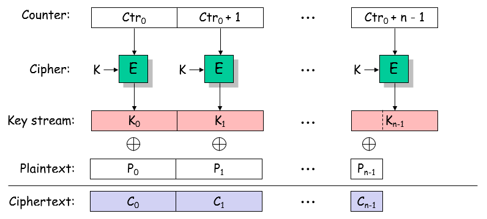

# **Kriptografija i mrežna sigurnost - Lab 3**

## CTR mode and repeated IVs

_Counter (CTR) mode_ je način enkripcije kod kojeg se primjenom blok šifre (npr., AES) realizira funkcionalnost slijedne šifre (_stream cipher_). CTR mode generira _pseudo-slučajan_ niz ključeva na način da enkriptira odgovarajuće i sukcesivne vrijednosti brojača (_counter_). _Plaintext_ se zatim enkriptira jednostavnom _xor_ operacijom s generiranim _pseudo-slučajnim_ nizom ključeva (vidi sliku u nastavku).

<p align="center">

<br><br>
<em>Enkripcija u CTR modu</em>
</p>

CTR mod je siguran način enkripcije (osigurava povjerljivost podataka) ali uz važan preduvjet: **isti brojač (_counter_) ne smije se ponoviti (enkriptirati) dva puta pod istim enkripcijskim ključem _K_**. U slučaju ponavljanja istog brojača (pod istim ključem K), moguće je dekriptirati _plaintext_ bez poznvanja enkripcijskog ključa. Sličan propust smo vidjeli kod Vernamove šifre.

### Repeated IVs/counters

U ovoj vježi pokazat ćemo _ranjivost CTR enkripcijskog moda u slučaju kad nije ispunjena pretpostavka o neponavljanju brojača (counter-a)_.

Kao i kod CTR moda, student će implementirati _chosen-plaintext attack (CPA)_, odnosno slati će upite (tj. _plaintext_) _crypto oracle_-u koji će iste enkriptirati u CTR modu i potom vraćati enkriptirani _ciphertext_ natrag studentu. _Crypto oracle_ pri navedenoj enkripciji **bira inicijalni CTR/IV nasumično, ali iz ograničenog skupa brojeva**. Drugim rječima, entropija (mjera nepredvidivosti) inicijalne vrijednosti brojača pod kojim su enkriptirane studentove poruke je mala. Iz koda dostupnog na repozitoriju lako se da iščitati kako _crypto oracle_ generira ovaj CTR, te na osnovu toga lako se može procjeniti entropija istog.

Posljedica opisanog načina generiranja brojača za CTR mode je ta da se nakon određenog broja enkripcija brojač ponavlja što napadaču omogućuje dekripciju _plaintext_-a bez poznavanja enkripcijskog ključa. Prosječan broj poruka koje treba enkriptirati prije ponavljanja brojača student može procjeniti na osnovu entropije brojača.

Zadatak studenta je iskoristiti gore opisani propust u _crypto oracle_-u i dekriptirati vic o Chuck Norris-u koji je ovaj put enkriptiran u CTR modu, za razliku od prethodnih vježbi (CBC mode). 

**VAŽNO**: Student u okviru ove vježbe ne pokušava otkriti tajni _cookie_, odnosno enkripcijski ključ K, već odgovarajući pseudoslučajni _key stream_ (vidi gore priloženu sliku) pod kojim je enkriptirana šala/vic. 

### Opis REST API-ja

U ovoj vježbi student će slati sljedeće HTTP zahtjeve svom _crypto oracle_-u:

```Bash
POST /ctr HTTP/1.1
plaintext = 'b5cadfsdf'
```

**VAŽNO**: U ovoj vježbi _plaintext_ treba biti enkodiran kao `hex` string. Ako serveru pošaljete npr. `utf8` enkodiran _plaintext_, server će vam vratiti prazan _ciphertext_ ili samo djelomično enkriptiran _plaintext_.

Primjenom npr. `curl` alata (Kali Linux) navedeni zahtjev možete napraviti kako slijedi:

```Bash
curl -d plaintext='b5cadfsdf' -X POST http://localhost:3000/ctr
```

_Crypto oracle_ (vaš REST server) uzima vaš _plaintext_ enkriptira ga u CBC modu tajnim 256 bitnim ključem (`aes-256-ctr`) i vraća vam odgovarajući _ciphertext_; primjetite, _oracle_ ne vraća odgovarajući CTR odnosno inicijalizacijski vektor kako je to bio slučaj s CBC modom.

```Bash
{
    "ciphertext":"ea1331"
}
```

Odgovarajući _challenge ciphertext_ koji _oracle_ možete dobiti na upit:

```Bash
# Request
GET /ctr/challenge HTTP/1.1

# Response
{
    "ciphertext":"f4483ef1443c1f24e26b8c697875004d26a3cfdfc76e1b34fb78facc97009f2bb599a5a97addc444409b4ea38d"
}
```